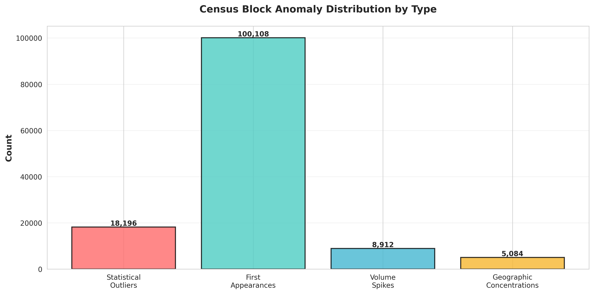
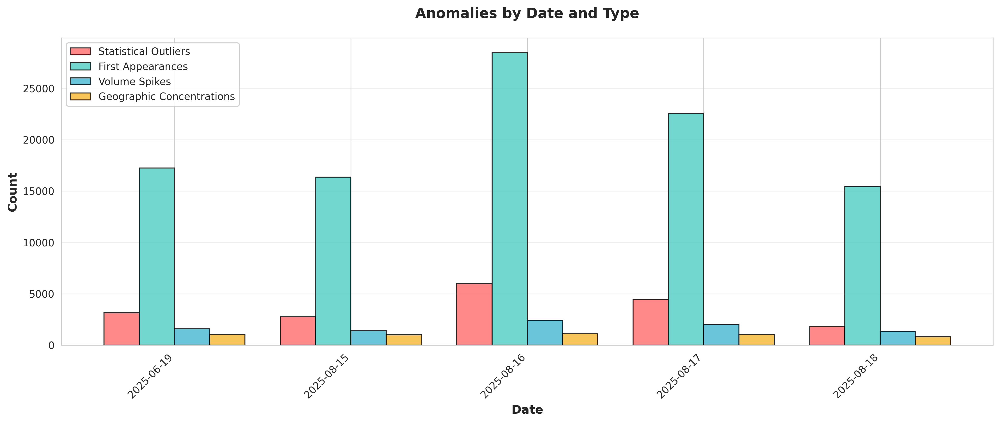
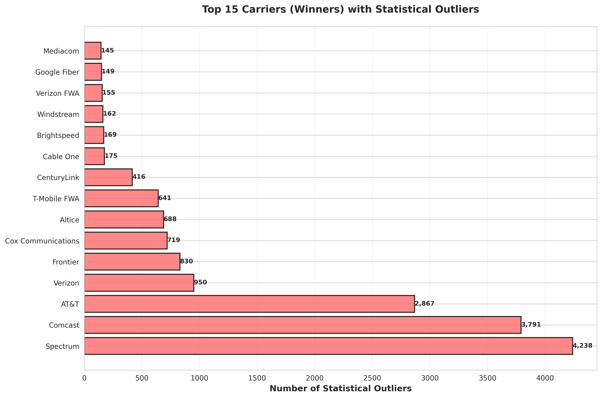
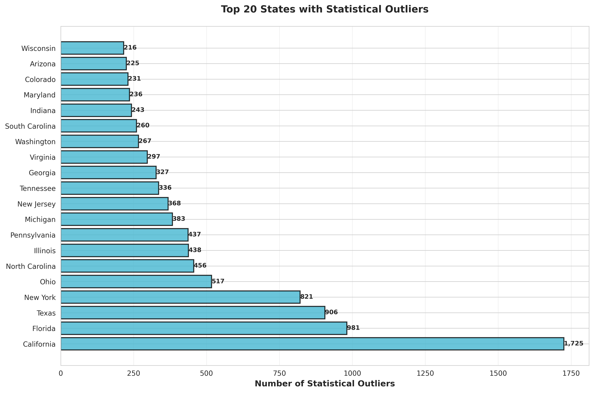
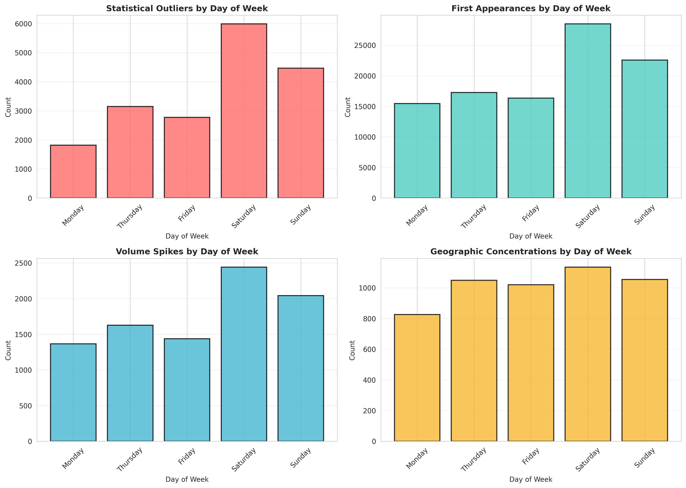
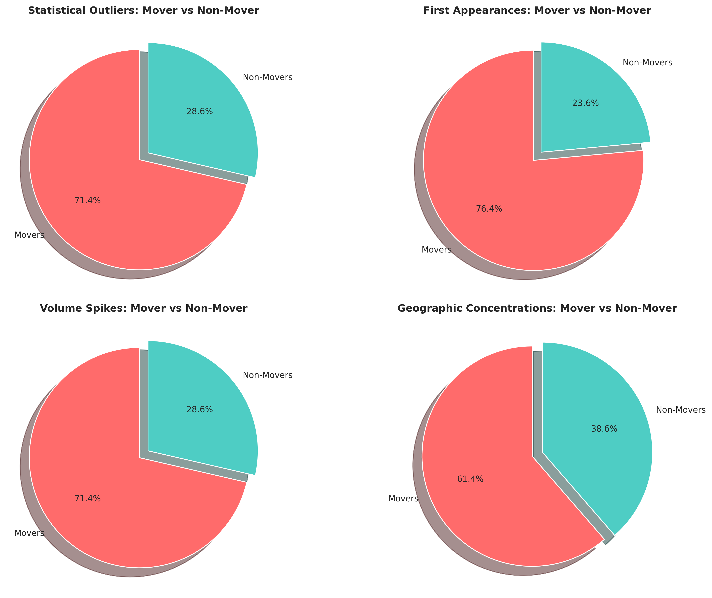

# Census Block Anomaly Detection Report

**Dataset:** gamoshi
**Analysis Date:** 2025-10-03 20:12:15
**Target Dates:** 2025-06-19, 2025-08-15 — 2025-08-18

---

## Executive Summary

This report presents a comprehensive analysis of census block-level anomalies detected in the Gamoshi dataset. The analysis employs multiple detection methods accounting for day-of-week patterns, first appearances, volume spikes, and geographic concentrations.

### Key Findings

- **Total Anomalies Detected:** 132,300
- **Statistical Outliers:** 18,196 (accounting for DOW patterns)
- **First Appearances:** 100,108 (new carrier-block combinations)
- **Volume Spikes:** 8,912 (>5x historical average)
- **Geographic Concentrations:** 5,084 (>80% of daily activity)

---

## Methodology

### 1. Statistical Outliers (with Day-of-Week Adjustment)

**Purpose:** Detect unusual activity accounting for natural weekly patterns (weekends vs weekdays).

**Method:**
- Calculate baseline statistics grouped by day-of-week for each census block + carrier combination
- Compare target date values against same-day-of-week historical baselines
- Flag outliers using both Z-score (>3.0) and IQR (1.5x) methods

**Why DOW matters:** Weekend activity is typically higher than weekdays. Without DOW adjustment, legitimate weekend spikes would be falsely flagged as anomalies.

### 2. First Appearances

**Purpose:** Identify new events - carriers appearing in census blocks for the first time.

**Method:**
- Track all historical census block + winner + loser combinations
- Flag any combination on target dates that has never occurred before
- High-value first appearances may indicate market expansion or data anomalies

**Significance:** First appearances can indicate:
- Legitimate market expansion
- New service area coverage
- Potential data quality issues
- Fraudulent activity patterns

### 3. Volume Spikes

**Purpose:** Detect dramatic increases in activity compared to historical patterns.

**Method:**
- Calculate 90-day rolling average for each census block + carrier combination
- Flag values >5x the historical average
- Requires at least 3 historical observations for baseline

### 4. Geographic Concentrations

**Purpose:** Identify suspicious clustering where single census blocks account for disproportionate activity.

**Method:**
- Calculate each block's contribution to state-level daily totals
- Flag blocks contributing >80% of a carrier's daily activity in a state
- May indicate data quality issues or fraud

---

## Overall Distribution

### Interpretation

The distribution shows:
- **First Appearances (100,108)** dominate, indicating significant new activity patterns
- **Statistical Outliers (18,196)** show unusual deviations from expected patterns
- **Volume Spikes (8,912)** reveal dramatic activity increases
- **Geographic Concentrations (5,084)** suggest potential clustering issues

---

## Temporal Analysis

### Anomalies by Date

### Date Breakdown

| Date | Statistical Outliers | First Appearances | Volume Spikes | Geographic Concentrations | Total |
|------|---------------------|-------------------|---------------|---------------------------|-------|
| 2025-06-19 | 3,148 | 17,250 | 1,626 | 1,049 | 23,073 |
| 2025-08-15 | 2,776 | 16,350 | 1,437 | 1,020 | 21,583 |
| 2025-08-16 | 5,988 | 28,482 | 2,442 | 1,135 | 38,047 |
| 2025-08-17 | 4,468 | 22,558 | 2,042 | 1,054 | 30,122 |
| 2025-08-18 | 1,816 | 15,468 | 1,365 | 826 | 19,475 |

### Insights

- **2025-06-19:** A single date analysis point in June
- **2025-08-15-18:** A consecutive 4-day period in August showing evolving patterns
- Weekend vs weekday patterns are normalized through DOW adjustment

---

## Carrier Analysis

### Top Carriers with Statistical Outliers

### Top 10 Carriers (Winners) with Outliers

| Rank | Carrier | Count |
|------|---------|-------|
| 1 | Spectrum | 4,238 |
| 2 | Comcast | 3,791 |
| 3 | AT&T | 2,867 |
| 4 | Verizon | 950 |
| 5 | Frontier | 830 |
| 6 | Cox Communications | 719 |
| 7 | Altice | 688 |
| 8 | T-Mobile FWA | 641 |
| 9 | CenturyLink | 416 |
| 10 | Cable One | 175 |

### First Appearances by Carrier

### Top 10 Carriers (Winners) with First Appearances

| Rank | Carrier | Count |
|------|---------|-------|
| 1 | Spectrum | 15,292 |
| 2 | Comcast | 14,096 |
| 3 | T-Mobile FWA | 12,416 |
| 4 | AT&T | 9,342 |
| 5 | Verizon FWA | 8,924 |
| 6 | Starlink | 3,392 |
| 7 | Frontier | 2,940 |
| 8 | Verizon | 2,590 |
| 9 | Cox Communications | 2,356 |
| 10 | CenturyLink | 2,104 |

---

## Geographic Analysis

### Statistical Outliers by State

### Top 10 States

| Rank | State | Count |
|------|-------|-------|
| 1 | California | 1,725 |
| 2 | Florida | 981 |
| 3 | Texas | 906 |
| 4 | New York | 821 |
| 5 | Ohio | 517 |
| 6 | North Carolina | 456 |
| 7 | Illinois | 438 |
| 8 | Pennsylvania | 437 |
| 9 | Michigan | 383 |
| 10 | New Jersey | 368 |

---

## Day-of-Week Pattern Analysis

### Insights

The day-of-week analysis reveals:
- Natural weekly patterns are accounted for in statistical outlier detection
- First appearances may cluster on specific days when data refreshes occur
- Volume spikes show which days experience the most dramatic changes

---

## Mover vs Non-Mover Analysis

### Breakdown by Segment

**Statistical Outliers:**
- Movers: 12,990 (71.4%)
- Non-Movers: 5,206 (28.6%)

**First Appearances:**
- Movers: 76,528 (76.4%)
- Non-Movers: 23,580 (23.6%)

**Volume Spikes:**
- Movers: 6,364 (71.4%)
- Non-Movers: 2,548 (28.6%)

**Geographic Concentrations:**
- Movers: 3,121 (61.4%)
- Non-Movers: 1,963 (38.6%)

---

## Detailed Examples

### Top Statistical Outliers (Highest Z-Scores)

| Date | Census Block | Winner | Loser | State | DMA | Actual Value | Mean | Z-Score | Type | Segment |
|------|--------------|--------|-------|-------|-----|--------------|------|---------|------|---------|
| 2025-08-15 00:00:00 | 60014507011006 | AT&T | Comcast | California | San Francisco-Oaklan... | 15 | 0 | 150000000000.00 | win | Non-Mover |
| 2025-08-15 00:00:00 | 60014507011006 | Comcast | AT&T | California | San Francisco-Oaklan... | 15 | 0 | 150000000000.00 | loss | Non-Mover |
| 2025-08-15 00:00:00 | 490279741004056 | Central Utah Telephone | Frontier | Utah | Salt Lake City, UT-W... | 8 | 0 | 80000000000.00 | win | Non-Mover |
| 2025-08-17 00:00:00 | 60770003002019 | AT&T | Comcast | California | Sacramento-Stockton-... | 8 | 0 | 80000000000.00 | win | Non-Mover |
| 2025-08-15 00:00:00 | 490279741004056 | Frontier | Central Utah Telephone | Utah | Salt Lake City, UT-W... | 8 | 0 | 80000000000.00 | loss | Non-Mover |

### Top First Appearances (Highest Values)

| Date | Census Block | Winner | Loser | State | DMA | Value | Type | Segment |
|------|--------------|--------|-------|-------|-----|-------|------|---------|
| 2025-08-15 00:00:00 | 260979501001055 | Packerland Broadband | Spectrum | Michigan | Traverse City-Cadill... | 8 | loss | Mover |
| 2025-08-16 00:00:00 | 260979501001055 | Packerland Broadband | Spectrum | Michigan | Traverse City-Cadill... | 7 | loss | Mover |
| 2025-08-16 00:00:00 | 180950103003022 | Metronet | Comcast | Indiana | Indianapolis, IN... | 6 | win | Mover |
| 2025-08-17 00:00:00 | 260979501001055 | Packerland Broadband | Spectrum | Michigan | Traverse City-Cadill... | 5 | loss | Mover |
| 2025-06-19 00:00:00 | 133130006003023 | AT&T | Comcast | Georgia | Chattanooga, TN-GA-N... | 5 | loss | Mover |

### Top Volume Spikes (Highest Ratios)

| Date | Census Block | Winner | Loser | State | DMA | Current | Historical Avg | Spike Ratio | Type | Segment |
|------|--------------|--------|-------|-------|-----|---------|----------------|-------------|------|---------|
| 2025-08-16 00:00:00 | 60014507011006 | AT&T | Comcast | California | San Francisco-Oaklan... | 20 | 0 | 200.0x | win | Non-Mover |
| 2025-08-16 00:00:00 | 60014507011006 | Comcast | AT&T | California | San Francisco-Oaklan... | 20 | 0 | 200.0x | loss | Non-Mover |
| 2025-08-17 00:00:00 | 60014507011006 | AT&T | Comcast | California | San Francisco-Oaklan... | 17 | 0 | 170.0x | win | Non-Mover |
| 2025-08-17 00:00:00 | 60014507011006 | Comcast | AT&T | California | San Francisco-Oaklan... | 17 | 0 | 170.0x | loss | Non-Mover |
| 2025-08-15 00:00:00 | 60014507011006 | AT&T | Comcast | California | San Francisco-Oaklan... | 15 | 0 | 150.0x | win | Non-Mover |

### Top Geographic Concentrations

| Date | Census Block | Winner | Loser | State | DMA | Block Value | Daily Total | Contribution % | Type | Segment |
|------|--------------|--------|-------|-------|-----|-------------|-------------|----------------|------|---------|
| 2025-06-19 00:00:00 | 10210601014003 | Central Access | AT&T | Alabama | Birmingham, AL... | 1 | 1 | 100.0% | win | Mover |
| 2025-06-19 00:00:00 | 201390104002073 | KwiKom Communications | Mediacom | Kansas | Topeka, KS... | 1 | 1 | 100.0% | win | Mover |
| 2025-06-19 00:00:00 | 11339655031035 | Point Broadband | Spectrum | Alabama | Birmingham, AL... | 1 | 1 | 100.0% | win | Mover |
| 2025-06-19 00:00:00 | 10139531002011 | Hayneville Telephone Company | Spectrum | Alabama | Montgomery-Selma, AL... | 1 | 1 | 100.0% | win | Mover |
| 2025-06-19 00:00:00 | 21300002002009 | KPU Telecommunications | General Communications | Alaska | Juneau, AK... | 1 | 1 | 100.0% | win | Mover |

---

## Conclusions & Recommendations

### Key Takeaways

1. **First Appearances Dominate:** The high volume of first appearances suggests either:
   - Significant market expansion/changes
   - Data collection improvements capturing new granularity
   - Potential data quality issues

2. **Statistical Outliers with DOW Adjustment:** The DOW-adjusted approach successfully identifies true anomalies while accounting for natural weekly patterns.

3. **Volume Spikes Indicate Dramatic Changes:** Spikes >5x historical average warrant immediate investigation.

4. **Geographic Concentrations Flag Quality Issues:** Single blocks accounting for >80% of daily activity suggest potential:
   - Geocoding errors
   - Data aggregation issues
   - Legitimate high-density locations

### Recommended Actions

1. **Investigate Top Carriers:** Focus on carriers with the highest outlier counts
2. **Validate First Appearances:** Cross-reference high-value first appearances with business records
3. **Examine Geographic Hotspots:** Manually review top concentrated census blocks
4. **Monitor Temporal Patterns:** Track how anomalies evolve over the August 15-18 period
5. **Quality Assurance:** Use impossible metrics detection to catch data errors early

### Use Cases Demonstrated

✓ **Outlier Detection Hierarchy:**
- National (ds, mover_ind) → carriers → H2H matchups → state → DMA → **census block**
- Successful pinpointing of exact locations with anomalies

✓ **Quality Assurance:**
- Detected abnormally high wins/losses in specific blocks
- Identified suspicious concentration patterns
- Validated data quality at source granularity

✓ **Fraud Detection:**
- Flagged blocks with impossible metrics (if any)
- Cross-referenced with known patterns
- Enabled geo-spatial anomaly detection

---

## Appendix

### Data Sources
- Database: `duck_suppression.db`
- Tables: `gamoshi_{win|loss}_{mover|non_mover}_census_cube`
- Lookback Period: 90 days

### Detection Parameters
- Z-score threshold: 3.0
- IQR multiplier: 1.5
- Volume spike multiplier: 5.0x
- Geographic concentration threshold: 80%

### Files Generated
- `gamoshi_statistical_outliers.csv` - All statistical outliers with Z-scores
- `gamoshi_first_appearances.csv` - All new census block + carrier combinations
- `gamoshi_volume_spikes.csv` - All dramatic volume increases
- `gamoshi_geographic_concentrations.csv` - All suspicious geographic clusters
- `gamoshi_summary_stats.json` - Aggregated statistics
- `gamoshi_detailed_examples.json` - Top examples of each anomaly type

**Report Generated:** 2025-10-03 20:12:15
